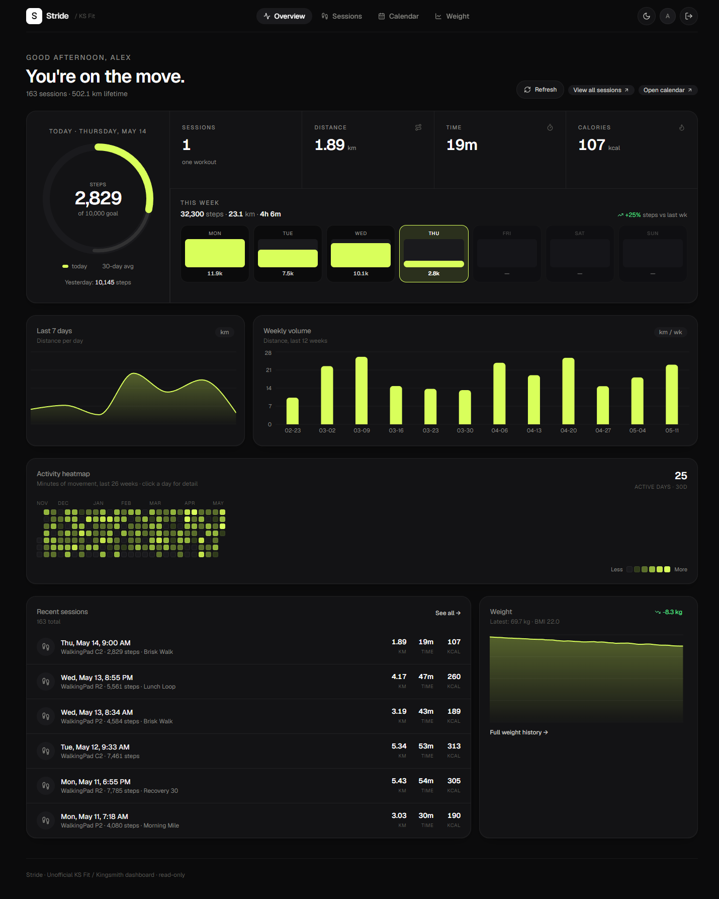
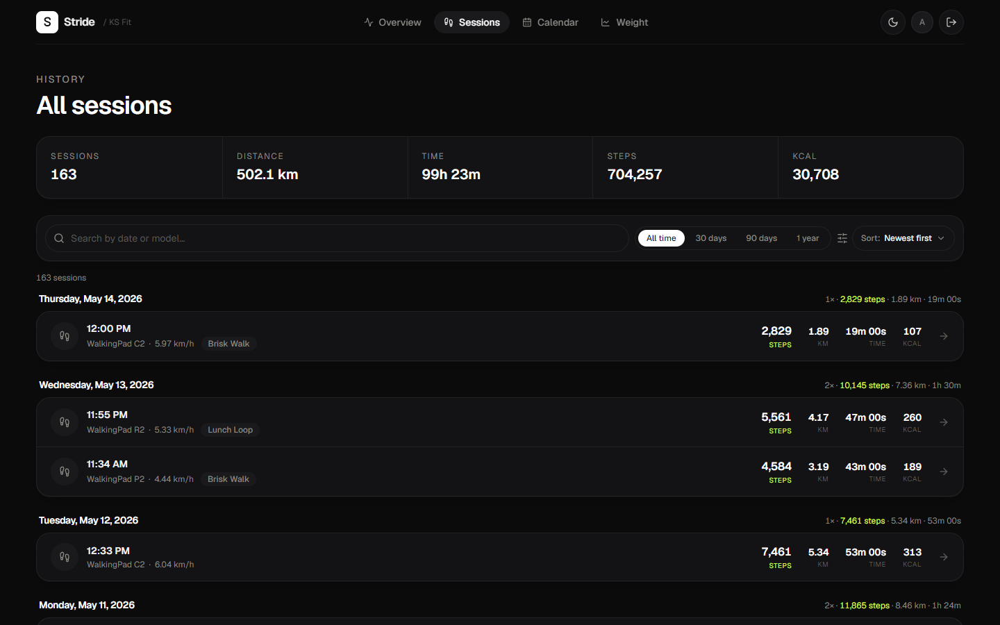
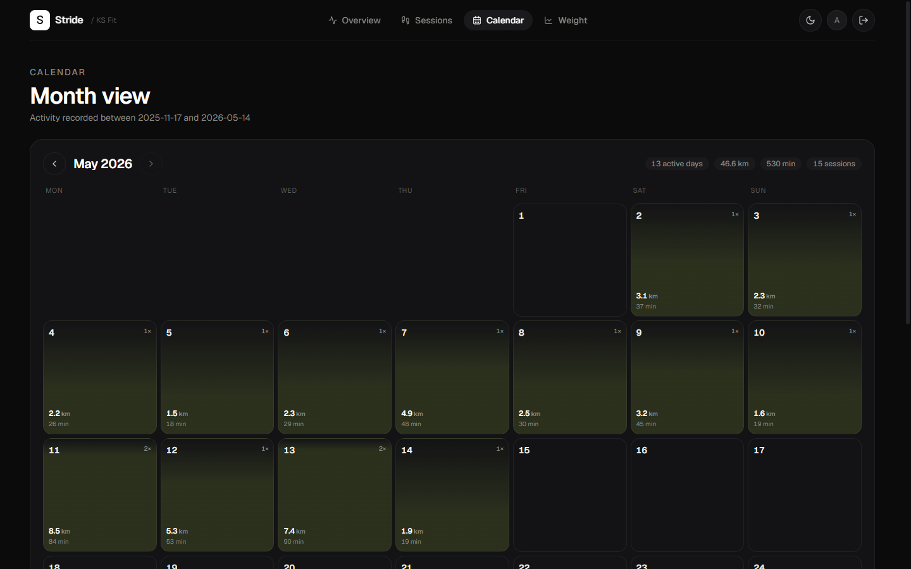
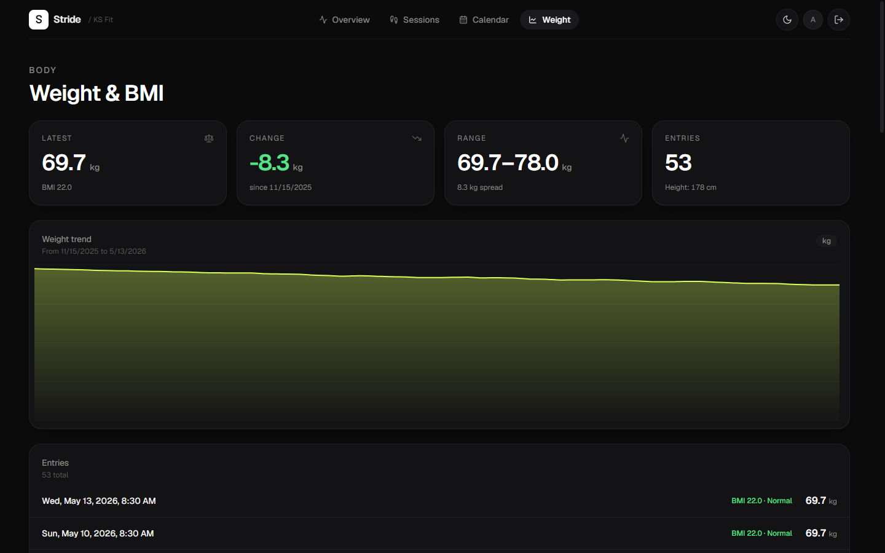
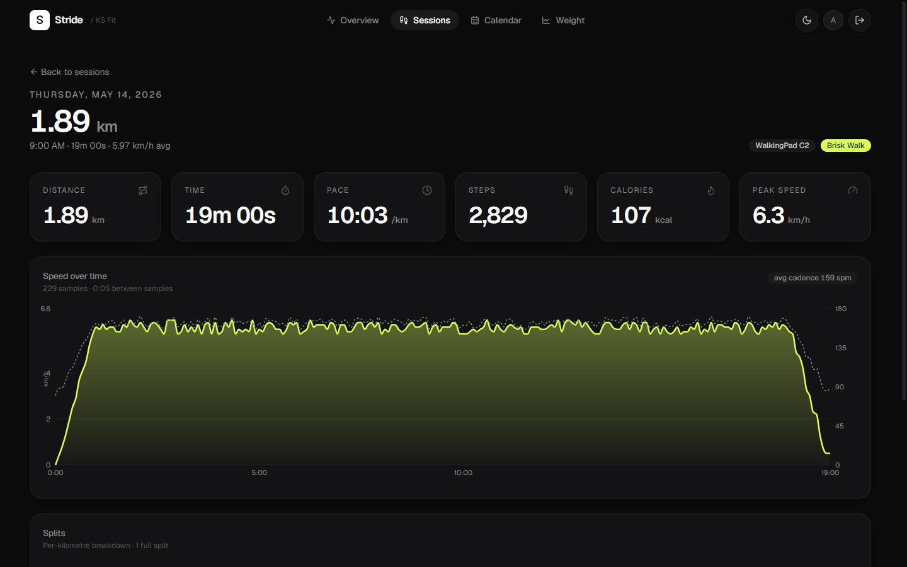
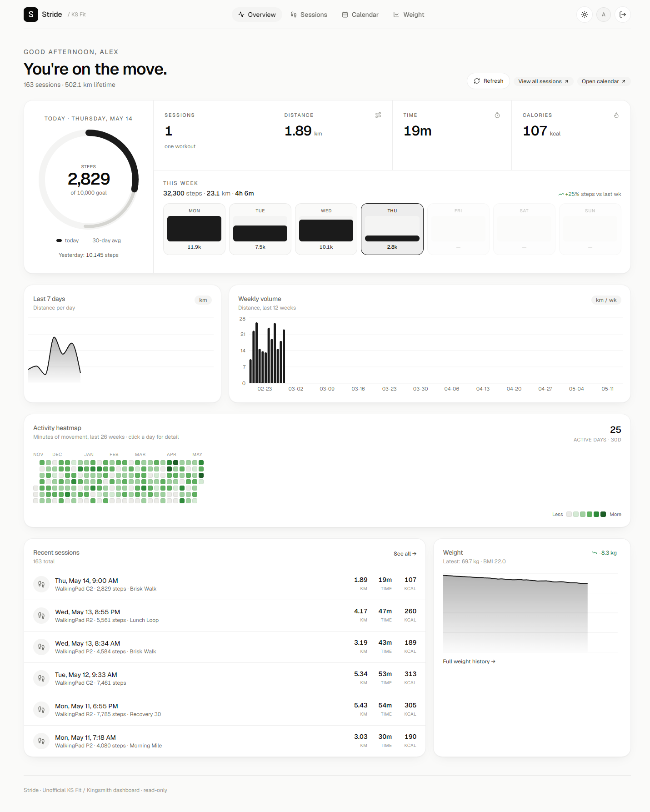

# ksfit

An unofficial, read-only Python client and Next.js dashboard for accessing **your own** account data on the **KS Fit** cloud service (the companion service for Kingsmith / WalkingPad treadmill devices).

I built it because the official mobile app doesn't let me get a CSV of my own walking history, weight log, or per-session telemetry off the device — this client reads that data over the public HTTPS API and renders it as a self-hosted dashboard.



> **Not affiliated with, endorsed by, or connected to Kingsmith or the KS Fit service.** "KS Fit", "Kingsmith", and "WalkingPad" are trademarks of their respective owners. This project is independent personal tooling intended for users who want programmatic access to data on their own account. Use at your own risk; the API is undocumented and may change or break at any time.

> The screenshots throughout this README are rendered from the bundled **demo dataset** (synthetic, deterministic) — no real account data is shown.

## What it does

- **Read-only.** The client never writes, deletes, or mutates anything on your account. Every method maps to a `GET`-style endpoint that the official app also calls when you open the relevant screen.
- **Your account only.** Authentication uses your own email + password; there is no scraping, no impersonation, no shared credentials.
- **Local-first.** Everything runs on your machine. The web dashboard talks to the upstream service directly from your browser session via a small Next.js BFF layer; nothing is sent to a third party.

### Data you can get back

- Every recorded session (distance, duration, steps, calories, heart-rate summary, start time, device model).
- Per-second telemetry for any one session (point list).
- Weight log entries with BMI and body-composition fields.
- Bound devices.
- Subscribed training plans and their day-by-day items.
- Course catalog, favorites, and history.
- Family-share group membership.
- System notices and inbox.

## Python client

### Setup

```bash
python3 -m venv .venv && source .venv/bin/activate
pip install -r requirements.txt
cp .env.example .env   # then fill in KSFIT_EMAIL / KSFIT_PASSWORD
python examples/login.py
```

`KSFIT_XJID` / `KSFIT_TOKEN` / `KSFIT_REFRESH_TOKEN` are written back to `.env` on a successful login and reused on subsequent runs, so you only log in once.

### Usage

```python
from ksfit import KSFitClient

c = KSFitClient()
c.login()                       # uses .env, caches the session token

# every session ever recorded for this user
res = c.sport_records()
print(f"{len(res['record'])} sessions; latest:", res['record'][0]['start_time'])

# per-second telemetry for one session
pts = c.record_points(res['record'][0]['run_id'])
print(pts['point']['point_list'][:200])

# weight history (each entry has BMI + body-composition fields)
for w in c.weight_log():
    print(w['add_time'], w['weight'], "kg  BMI", w['BMI'])

# bound devices
for d in c.devices()['list']:
    print(d['model'], d['did'], "bound", d['bind_time'])

# subscribed training plans
for s in c.schedules():
    print(s['title'], s['start_date'], '→', s['end_date'])
```

See `ksfit/client.py` for the full list of read methods.

## Web dashboard

A small Next.js app in `web/` renders your data as a personal dashboard: calendar heatmap, per-session charts, weight trend, and a sessions list.

```bash
cd web
npm install
npm run dev
# then visit http://localhost:3000 and log in with your KS Fit credentials
```

By default you log in via the in-app form and the resulting session token is stored in an `httpOnly` cookie.

#### Single-user auto-login (optional)

For a private, self-hosted install that only you use, you can skip the login form entirely: put your credentials in `web/.env.local` (gitignored) and the app logs in automatically on first request, caching the session in memory.

```bash
# web/.env.local
KSFIT_EMAIL=you@example.com
# Single-quote the password if it contains '#', '$', or spaces, or dotenv will mangle it.
KSFIT_PASSWORD='your-password'
```

> **Only enable this on a host that's truly single-user and not reachable from the open internet.** In auto-login mode there is no login gate — anyone who can reach the app sees your data. Keep it bound to localhost / your LAN behind a reverse proxy (see [Docker](#docker) and `docs/ROADMAP.md`). Leave both vars unset to fall back to the normal in-app login. Setting `KSFIT_DEMO=1` bypasses auto-login.

### Try it without an account

A built-in demo mode renders the whole UI from a synthetic, deterministic dataset. No login required, no network calls to KS Fit:

```bash
cd web
KSFIT_DEMO=1 npm run dev
```

### Screenshots

| | |
| --- | --- |
|  |  |
| Sessions list with lifetime totals | Calendar month view |
|  |  |
| Weight trend + BMI history | Per-session speed/cadence telemetry |

Light mode is also supported:



### Docker

```bash
docker compose up --build
```

The bundled `docker-compose.yml` builds the Next.js app and binds it to
`127.0.0.1:3005` (front it with a reverse proxy).

### Home-network deployment

To serve it on your LAN at a hostname like `treadmill.home` with trusted local
HTTPS (no browser warnings), see **[docs/DEPLOY.md](docs/DEPLOY.md)** — a
step-by-step UniFi + Caddy runbook. A ready `Caddyfile` is at the repo root, and
`docker compose --profile proxy up` runs Caddy as a sibling container.

## Notes / gotchas

- Login uses your email plus the `md5` of your password (the official app does the same; the server validates the hash). Your plaintext password never leaves your machine in this client either.
- After a handful of failed logins from one IP the server temporarily rate-limits that IP. Don't burn attempts in a loop.
- The session token is a JWT with an expiry baked into it. The client refreshes opportunistically on `401`.

## License

MIT — see [LICENSE](./LICENSE).
